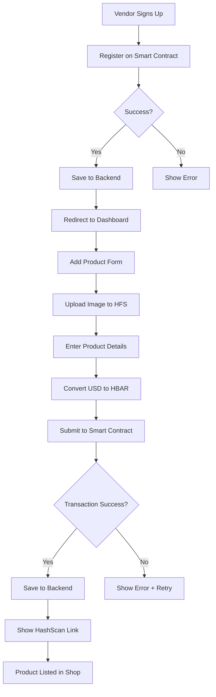
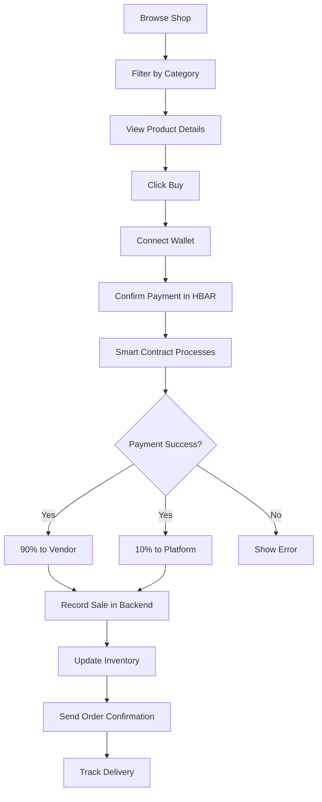

# ♻️ Pick-n-Get — Decentralized Recycling & Sustainable Marketplace

_Empowering communities to recycle waste, earn rewards, and trade eco-friendly products through blockchain technology._

---

## 🔗 Quick Links

- [Pitchdeck](#-pitchdeck)
- [Overview](#-overview)
- [Product Marketplace](#-product-marketplace)
- [Architecture](#-architecture)
- [Smart Contracts](#-smart-contracts)
- [Team Certifications](#-team-certifications)
- [Repository Structure](#-repository-structure)

---

---

## 🎯 Pitch Deck

[View Our Presentation](https://www.canva.com/design/DAG3RD8BBFA/qTiX85EvlfT2TE-ARtXpmQ/edit?utm_content=DAG3RD8BBFA&utm_campaign=designshare&utm_medium=link2&utm_source=sharebutton)

---

## 📘 Overview

Pick-n-Get is a comprehensive decentralized platform built on Hedera Hashgraph that combines:

1. **♻️ Recycling Rewards System** - Users earn HBAR for verified recycling
2. **🏪 Sustainable Marketplace** - Vendors sell eco-friendly products made from recycled materials
3. **🚚 Delivery Network** - Verified riders collect recyclables and deliver products
4. **👥 Community Governance** - Transparent, blockchain-verified operations

---

## 🏪 Product Marketplace

### Overview

The Product Marketplace allows **producers/vendors** to sell sustainable products made from recycled materials directly to consumers, with all transactions recorded on the Hedera blockchain.

### How It Works

```
┌─────────────────────────────────────────────────────────────────┐
│                    PRODUCT MARKETPLACE FLOW                      │
└─────────────────────────────────────────────────────────────────┘

    1. VENDOR REGISTRATION
    ┌────────────────────┐
    │   Vendor Signs Up  │
    │  (Smart Contract)  │
    └──────────┬─────────┘
               │
               ▼
    ┌────────────────────┐
    │  Save to Backend   │
    │   (Database)       │
    └──────────┬─────────┘
               │
               ▼
    ┌────────────────────┐
    │ Vendor Dashboard   │
    │   Access Granted   │
    └────────────────────┘

    2. ADD PRODUCT
    ┌────────────────────┐
    │  Vendor Uploads    │
    │    Product Info    │
    └──────────┬─────────┘
               │
               ▼
    ┌────────────────────┐
    │  Upload Image to   │
    │  Hedera File Svc   │
    │ (Get File ID)      │
    └──────────┬─────────┘
               │
               ▼
    ┌────────────────────┐
    │ Convert USD → HBAR │
    │  (Auto-convert)    │
    └──────────┬─────────┘
               │
               ▼
    ┌────────────────────┐
    │  Smart Contract    │
    │   addProduct()     │
    └──────────┬─────────┘
               │
               ▼
    ┌────────────────────┐
    │  Save to Backend   │
    │   (with txHash)    │
    └──────────┬─────────┘
               │
               ▼
    ┌────────────────────┐
    │ Product Listed on  │
    │    Marketplace     │
    └────────────────────┘

    3. CUSTOMER PURCHASE
    ┌────────────────────┐
    │  Browse Products   │
    │   (Shop Page)      │
    └──────────┬─────────┘
               │
               ▼
    ┌────────────────────┐
    │  Select & Buy      │
    │  (Pay in HBAR)     │
    └──────────┬─────────┘
               │
               ▼
    ┌────────────────────┐
    │  Smart Contract    │
    │   shopProduct()    │
    │ • 10% → Platform   │
    │ • 90% → Vendor     │
    └──────────┬─────────┘
               │
               ▼
    ┌────────────────────┐
    │  Record Sale       │
    │   (Backend)        │
    └──────────┬─────────┘
               │
               ▼
    ┌────────────────────┐
    │  Update Inventory  │
    │ Auto-mark Sold Out │
    └────────────────────┘
```

### Key Features

| Feature                         | Description                                    |
| ------------------------------- | ---------------------------------------------- |
| 🔐 **Blockchain Registration**  | All vendors registered on smart contract first |
| 💰 **USD to HBAR Conversion**   | Automatic price conversion with live rates     |
| 📦 **Inventory Management**     | Real-time stock tracking on-chain              |
| 💸 **Instant Payments**         | 90% to vendor, 10% platform fee                |
| 🔍 **Transparent Transactions** | All sales verified on Hedera                   |
| 🖼️ **Decentralized Storage**    | Images stored on Hedera File Service           |

### Product Categories

- 👜 Bags & Accessories
- 🪑 Furniture
- 📎 Office Supplies
- 💪 Fitness & Wellness
- 🏡 Home & Garden
- 👕 Textiles
- 💻 Electronics
- ➕ Others

---

## 🏗️ Architecture

### Technology Stack

**Frontend:**

- React + TypeScript + Next.js
- TailwindCSS for styling
- HashPack & MetaMask wallet integration
- Real-time HBAR price conversion

**Backend:**

- Node.js + Express
- MongoDB for data persistence
- RESTful API architecture
- Hedera SDK integration

**Smart Contracts:**

- Solidity ^0.8.28
- Deployed on Hedera Testnet
- HBAR native payments
- 8-decimal precision (tinybars)

**Storage:**

- Hedera File Service (HFS) for images
- On-chain product metadata
- Backend caching for performance

### System Architecture

```
┌─────────────────────────────────────────────────────────────────┐
│                         FRONTEND LAYER                           │
│  React + Next.js + TailwindCSS + Wallet Integration             │
└───────────────────────┬─────────────────────────────────────────┘
                        │
                        ▼
┌─────────────────────────────────────────────────────────────────┐
│                      WALLET INTERFACE                            │
│              HashPack / MetaMask Integration                     │
└───────────────────────┬─────────────────────────────────────────┘
                        │
        ┌───────────────┴───────────────┐
        ▼                               ▼
┌──────────────────┐          ┌──────────────────┐
│  SMART CONTRACTS │          │   BACKEND API    │
│   Hedera DLT     │◄────────►│   Node.js        │
│                  │          │   MongoDB        │
│ • PicknGet.sol   │          │                  │
│ • Product.sol    │          │ • REST API       │
│ • User.sol       │          │ • Data Cache     │
│ • Admin.sol      │          │ • Analytics      │
└────────┬─────────┘          └──────────────────┘
         │
         ▼
┌─────────────────────────────────────────────────────────────────┐
│                    HEDERA FILE SERVICE                           │
│              Decentralized Image Storage (HFS)                   │
└─────────────────────────────────────────────────────────────────┘
```

---

## 📜 Smart Contracts

### Contract Addresses (Hedera Testnet)

| Contract     | Address       | Explorer                                                             |
| ------------ | ------------- | -------------------------------------------------------------------- |
| **PicknGet** | `0.0.7162853` | [View on HashScan](https://hashscan.io/testnet/contract/0.0.7162853) |
| **Product**  | `0.0.7165733` | [View on HashScan](https://hashscan.io/testnet/contract/0.0.7165733) |

### Contract Functions

**Product Contract:**

```solidity
// Vendor Registration
function registerProductOwner(
    address _owner,
    string _name,
    string _country,
    uint256 _phoneNumber
) external

// Add Product
function addProduct(
    string _name,
    uint256 _quantity,
    string _description,
    string _imageFileId,
    uint256 _amount
) external returns (uint256 productId)

// Purchase Product
function shopProduct(
    uint256 _producerId,
    uint256 _quantity
) external payable

// Get Product Details
function getProduct(uint256 _productId)
    external view returns (ProductItem memory)
```

### Payment Distribution

```
Customer Payment (100%)
    │
    ├─► 10% → PicknGet Platform
    │
    └─► 90% → Vendor Wallet
```

---

## 🔄 Complete User Flows

### Vendor Flow



### Customer Flow



---

## 📊 API Endpoints

### Product Endpoints

```typescript
// Vendor Management
POST   /api/v1/products/producers
GET    /api/v1/products/vendors/:walletAddress/stats
GET    /api/v1/products/vendors/:walletAddress/products
GET    /api/v1/products/vendors/:walletAddress/orders

// Product Management
POST   /api/v1/products
GET    /api/v1/products
GET    /api/v1/products/:productId
PATCH  /api/v1/products/:productId/status
POST   /api/v1/products/:productId/sale

// Currency Conversion
GET    /api/v1/products/conversion/hbar-to-usd
POST   /api/v1/products/conversion/usd-to-hbar
```

### Authentication Endpoints

```typescript
POST / api / v1 / auth / check - wallet;
POST / api / v1 / auth / save - user;
POST / api / v1 / users / verify - phone;
```

---

## 💡 Key Features

### For Vendors

- ✅ Register on blockchain with verification
- ✅ List unlimited products
- ✅ Real-time inventory tracking
- ✅ Instant HBAR payments (90% revenue)
- ✅ Dashboard with analytics
- ✅ Transaction history on HashScan

### For Customers

- ✅ Browse eco-friendly products
- ✅ Pay with HBAR (crypto)
- ✅ Transparent pricing
- ✅ Verified product authenticity
- ✅ Delivery tracking
- ✅ Blockchain-verified purchases

### For the Platform

- ✅ 10% commission on sales
- ✅ Decentralized payment system
- ✅ No chargebacks or fraud
- ✅ Transparent fee structure
- ✅ Immutable transaction records

---

## 🎓 Team Certifications

### Hedera Hashgraph Certified Developers

- **Matthew Idungafa** - [Hedera Developer Certification](https://certs.hashgraphdev.com/7e9701d5-37ee-4ec0-979b-81f895586fe6.pdf)
- **Joy Aruku** - [Hedera Developer Certification](https://certs.hashgraphdev.com/353ac361-2257-4165-839e-18ed4d9f07fe.pdf)

---

## 📂 Repository Structure

| Repository    | Description              | Link                                                         |
| ------------- | ------------------------ | ------------------------------------------------------------ |
| **Frontend**  | React + Next.js UI       | [View Code](https://github.com/kemsguy7/pick-n-get-fe)       |
| **Backend**   | Node.js API + MongoDB    | [View Code](https://github.com/Dev-JoyA/pick-n-get-be)       |
| **Contracts** | Solidity Smart Contracts | [View Code](https://github.com/Dev-JoyA/pick-n-get-contract) |

---

## 🚀 Getting Started

### Prerequisites

- Node.js v16+
- MongoDB
- Hedera Testnet Account
- HashPack or MetaMask Wallet

### Installation

**Frontend:**

```bash
git clone https://github.com/kemsguy7/pick-n-get-fe
cd pick-n-get-fe
npm install
cp .env.example .env.local
npm run dev
```

**Backend:**

```bash
git clone https://github.com/Dev-JoyA/pick-n-get-be
cd pick-n-get-be
npm install
cp .env.example .env
npm run dev
```

**Smart Contracts:**

```bash
git clone https://github.com/Dev-JoyA/pick-n-get-contract
cd pick-n-get-contract
npm install
npx hardhat run scripts/deployProduct.ts --network testnet
```

---

## 🔐 Security Features

- ✅ Role-based access control (Vendor/Customer/Admin)
- ✅ Wallet signature verification
- ✅ Smart contract payment validation
- ✅ Double-spend prevention
- ✅ Immutable transaction records
- ✅ Encrypted sensitive data

---

## 📈 Future Roadmap

- [ ] Multi-chain support (Ethereum, Polygon)
- [ ] NFT certificates for recycled products
- [ ] DAO governance for platform decisions
- [ ] Mobile app (iOS & Android)
- [ ] Integration with major e-commerce platforms
- [ ] Carbon credit tracking
- [ ] Loyalty rewards program

---

## 📄 License

UNLICENSED — Intended for research and hackathon purposes.  
Contact maintainers for enterprise licensing.

---

## 🤝 Contributing

We welcome contributions! Please read our contributing guidelines before submitting PRs.

---

## 📞 Contact

- **Project Lead**: Matthew Idungafa
- **Technical Lead**: Joy Aruku
- **Website**: [Coming Soon]
- **Email**: support@picknget.com

---

♻️ **Pick-n-Get, keeping African Cities Clean**
